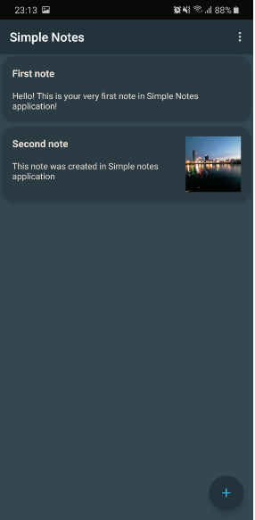
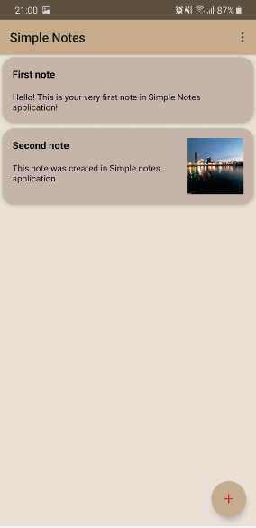
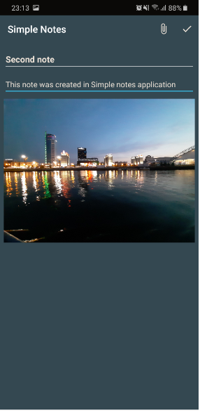
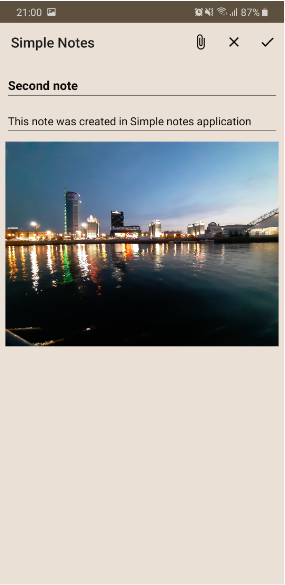

# SimpleNotes
**SimpleNotes** is an Android application, that allows you to create, store and edit notes.
Application uses Firebase API, such as [Authentication](https://firebase.google.com/products/auth/), 
[Cloud Firestore](https://firebase.google.com/products/firestore/) and [Cloud Storage](https://firebase.google.com/products/storage/).
Using this app you can create an account (or sing in to existing one), create new notes (including attaching images to your notes), 
save your notes in Firestore and Cloud Storage (for images) or delete unnecessary notes.
Please, note that there are some [restrictions](https://firebase.google.com/pricing) for free accounts in Firebase. This means, that
you are limited in uploading/downloading images while using Simple Notes, because this application was created with free account.  
---
# Screenshots
Sign in/up to SimpleNotes:  
   
Look through saved notes, open one of them or create new note:  
   
Edit your note, attach an image, save it or delete:  
  
